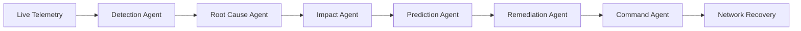
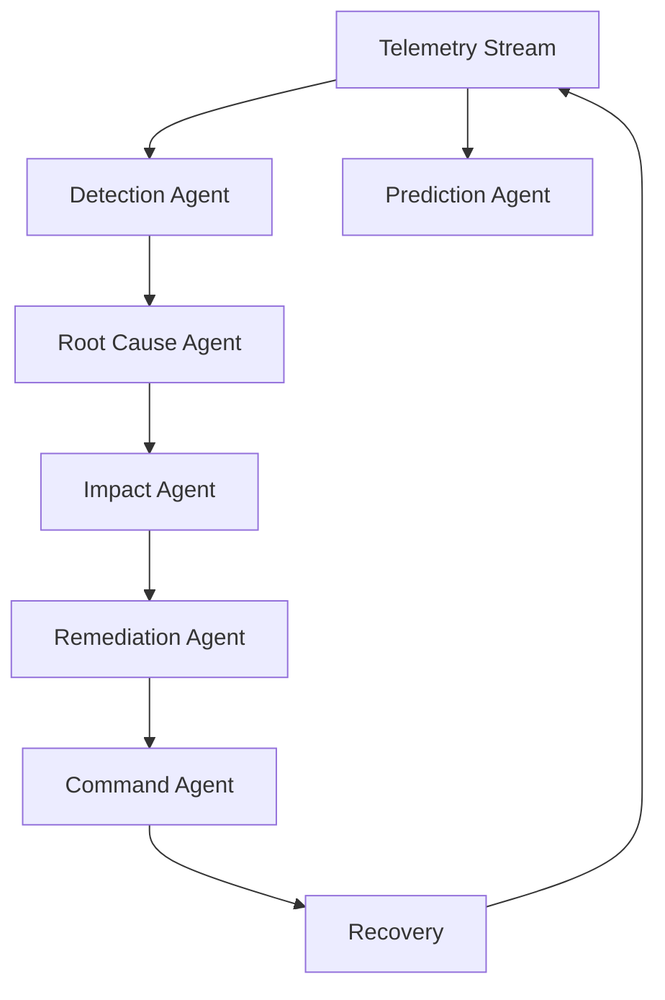
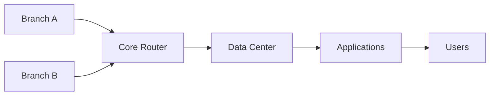
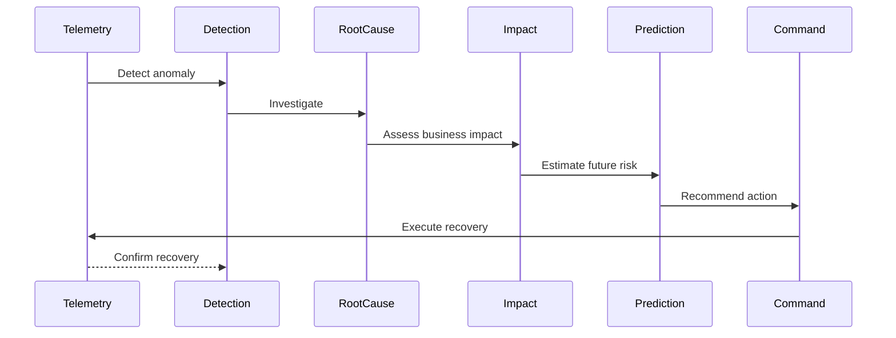
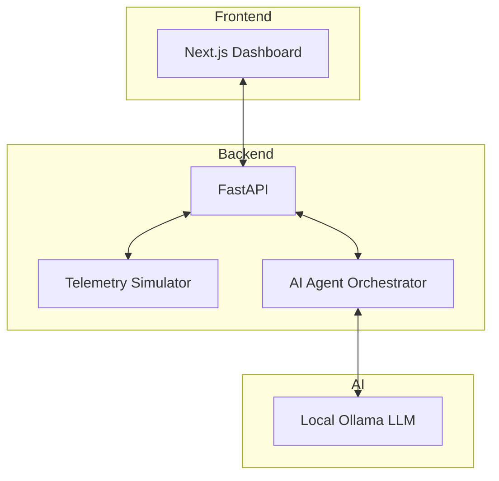
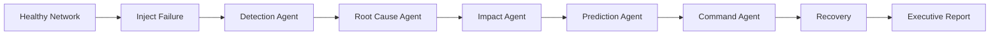

# 🚀 NetSentinel AI

### Autonomous Multi-Agent Network Operations Copilot

NetSentinel AI transforms enterprise network operations from reactive monitoring into autonomous AI-driven incident management.

Instead of simply displaying dashboards, NetSentinel deploys specialized AI agents that detect anomalies, investigate root causes, predict failures, assess business impact, recommend remediation, and execute recovery actions.

---

# Problem

Modern enterprise networks generate millions of telemetry events.

Traditional monitoring tools:

❌ Show alerts

❌ Show graphs

❌ Require human investigation

❌ Require manual remediation

This creates:

* Long Mean Time To Resolution (MTTR)
* Expensive outages
* Operational overload

---

# Solution

NetSentinel AI acts as an autonomous Network Operations Center.

---

# Multi-Agent Architecture

---

# AI Agents

## Detection Agent

Analyzes:

* Latency
* Packet Loss
* CPU
* Bandwidth

Outputs:

* Incident Type
* Confidence
* Severity
* Trend

---

## Root Cause Agent

Determines:

* Primary Cause
* Alternative Causes
* Incident Severity

Examples:

* MPLS Congestion
* Branch Failure
* Router CPU Overload

---

## Impact Agent

Converts technical failures into business language.

Examples:

### Banking

* ATM disruption
* Online banking slowdown

### Healthcare

* EMR latency

### Retail

* POS transaction failures

---

## Prediction Agent

Forecasts future risk.

Outputs:

* Current Risk
* 15 Minute Risk
* 30 Minute Risk
* 60 Minute Risk

---

## Command Agent

Simulates autonomous operations.

Actions:

* Reroute Traffic
* Restart Router
* Failover Link
* Increase Capacity

---

# Enterprise Topology

---

# Incident Response Workflow

---

# Demo Scenarios

## MPLS Congestion

High latency on core links.

### AI Response

* Detects congestion
* Predicts increasing risk
* Recommends rerouting
* Executes traffic shift

---

## Branch Link Failure

Loss of remote connectivity.

### AI Response

* Detects outage
* Assesses affected users
* Recommends failover
* Restores service

---

## Router CPU Overload

Critical device saturation.

### AI Response

* Detects processing bottleneck
* Predicts outage risk
* Recommends restart
* Stabilizes telemetry

---

# Executive Mode

Converts network telemetry into business outcomes.

Displays:

* Downtime Prevented
* Cost Saved
* Revenue Risk
* Users Impacted
* Recommended Decisions

---

# System Architecture

---

# Technology Stack

| Layer        | Technology       |
| ------------ | ---------------- |
| Frontend     | Next.js          |
| UI           | React + Tailwind |
| Backend      | FastAPI          |
| Language     | Python           |
| AI Runtime   | Ollama           |
| Models       | Llama 3          |
| Architecture | Multi-Agent      |
| Deployment   | Local First      |

---

# Demo Flow

---

# Vision

Today:

Monitoring Networks

↓

Tomorrow:

Operating Networks

↓

Future:

Autonomous AI Network Operations Centers
